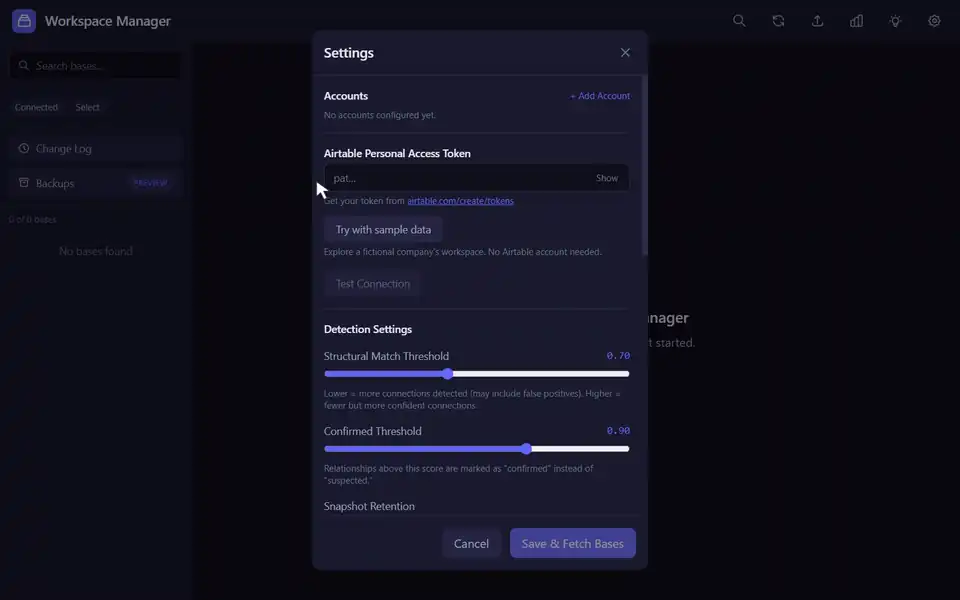
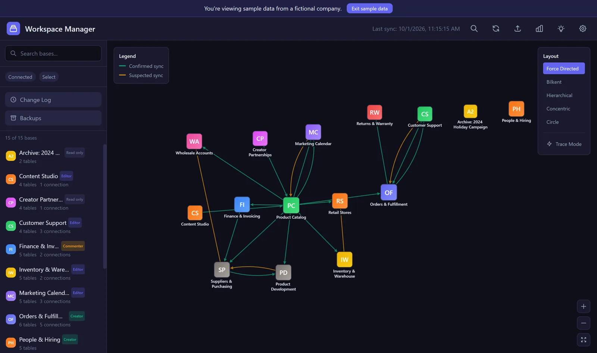
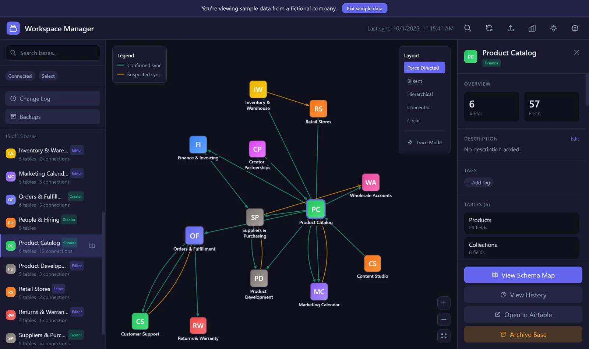
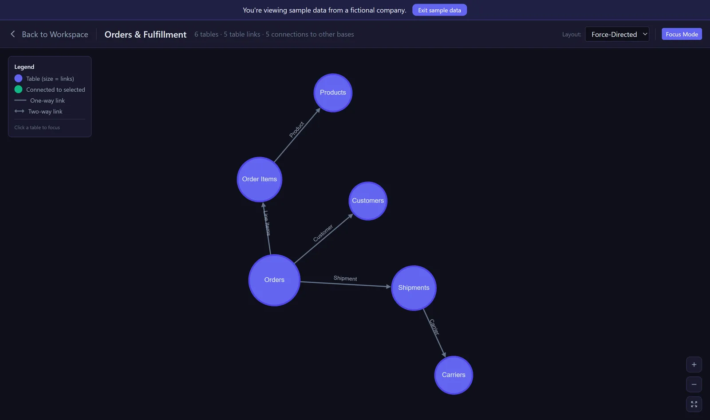
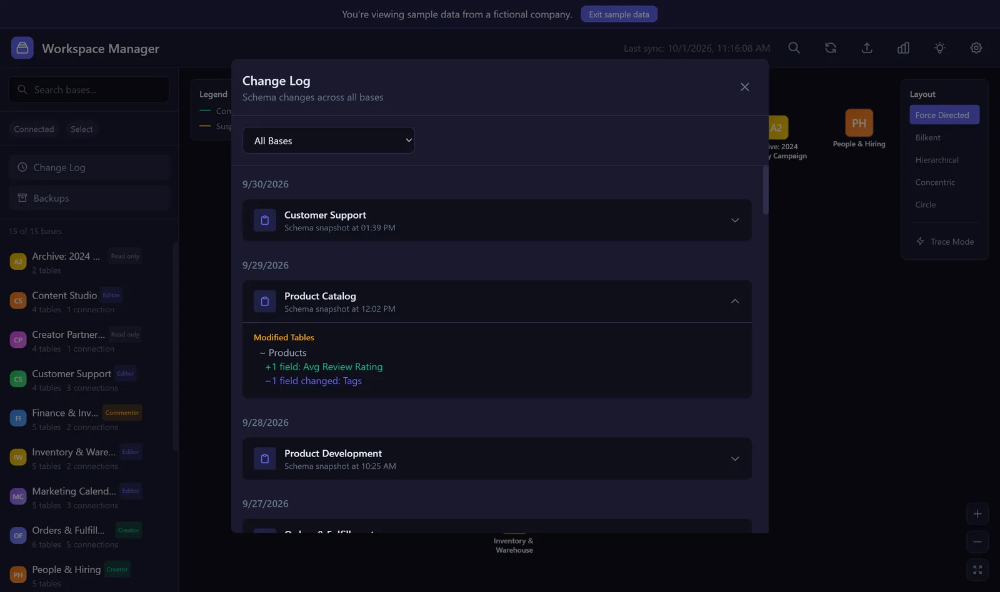
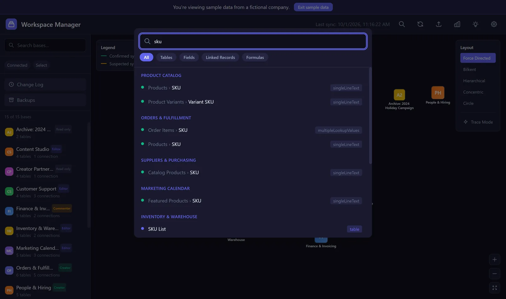
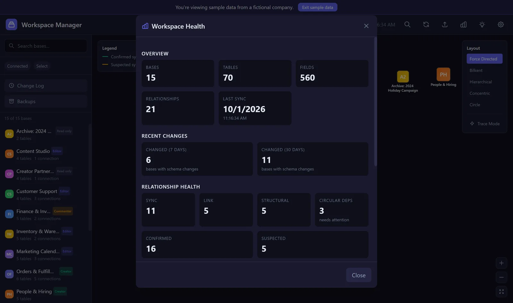
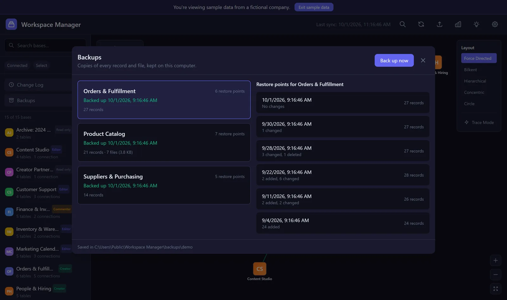

# Airtable Workspace Manager

A free, open-source, local-first desktop app for visualizing and managing complex Airtable workspaces. See every base as a map, catch sync and link relationships you'd otherwise track by hand, and get an optional AI health check of your schema using your own Anthropic API key. Your Airtable data stays on your machine: nothing goes to any server this project runs.



## Requirements

Windows 10 or newer, macOS 13 (Ventura) or newer, or 64-bit Linux. Building from source needs Node.js 22 or newer.

## What it does today

- **Workspace map:** every base in your workspace laid out as a graph (Cytoscape.js), with pan, zoom, and multiple layout options.
- **Sync and link detection:** automatically finds tables that are synced or linked across bases and draws the relationships as edges, with confidence scoring.
- **Schema history and diffs:** every refresh is compared against the last one, so you can see exactly what changed and when.
- **Impact analysis:** before you touch a base, see what depends on it: upstream sources, downstream dependents, and circular dependency warnings.
- **AI health check:** optional, using your own Anthropic API key. Unlocks base analysis, workspace-wide health scoring, and auto-generated documentation of anti-patterns and field purposes.
- **Exports:** CSV, JSON, Markdown, and Mermaid diagram exports of your workspace inventory.
- **Backups (preview):** incremental copies of records and attachments, kept on your computer. Each backup saves only what changed since the last one and becomes a restore point. Restoring from a restore point arrives in the next release.
- **Sample data mode:** click "Try with sample data" to explore a fictional company's workspace (Cedar & Pine Goods) in an isolated database, no Airtable account required.

## How it spots a sync nobody wrote down

Airtable records some syncs in a base's schema, and the app draws those as confirmed. It also catches the ones that were never recorded. When two bases each have a table with the same name, it compares their fields: how many field names they share (weighted 60%) and how many of those shared fields have the same type (weighted 40%). A score of 70% or more is drawn as a suspected sync, and 90% or more as confirmed. Both thresholds can be changed in Settings.



## Screenshots

All screenshots use the built-in sample data.

**Workspace map.** Every base as a node, with confirmed and suspected syncs drawn between them.



**Base detail.** Select a base to frame it with everything it connects to, and see its tables and field counts.



**Schema map.** Open a base to see how its tables link to each other.



**Change log.** Each refresh is compared with the last one, so added and changed fields show up on their own.



**Search.** Find a field or table across every base at once.



**Workspace health.** Counts of bases, tables, fields, and relationships, plus how many bases changed recently.



**Backups.** Each base keeps a list of restore points, showing when each one was taken and what changed since the one before.



## Roadmap

- Scheduled backups that run in the background.
- Restore: preview a restore point before you commit, and undo it if needed.
- Signed installers, so the first-launch warning goes away.

## Download and install

Download the installer for your computer from the [latest release](https://github.com/relaywright/airtable-workspace-manager/releases/latest).

The installers aren't signed yet. Signing certificates cost money every year and this is a free project, so the first time you open the app your computer will warn you that it doesn't recognize the developer. Here's how to get past that warning on each system.

### Windows

1. Download the file ending in `win-x64.exe`.
2. Open it. If Windows shows "Windows protected your PC", click **More info**, then **Run anyway**.
3. Follow the installer.

### macOS

1. Download the `.dmg` for your Mac: `mac-arm64` for Apple silicon (M1 and newer), `mac-x64` for Intel.
2. Open the `.dmg` and drag the app into Applications.
3. Open the app. When macOS says it can't verify the developer, click **Done** (**OK** on older versions of macOS).
4. Open **System Settings**, then **Privacy & Security**. Scroll down and click **Open Anyway** next to the app's name, then confirm.
5. If macOS says the app "is damaged and can't be opened", open Terminal and run:
   `xattr -cr "/Applications/Airtable Workspace Manager.app"`
   Then open the app again.

### Linux

1. Download the `.AppImage`.
2. Make it executable: right-click it, open **Properties**, and allow running it as a program. Or run `chmod +x Airtable-Workspace-Manager-*.AppImage`.
3. Double-click it to run.

## Token setup

You'll need an Airtable Personal Access Token:

1. Go to https://airtable.com/create/tokens
2. Click "Create new token"
3. Name it something like "Workspace Manager"
4. Add scopes: `schema.bases:read` and `data.records:read` (needed for backups)
5. Add access: "All current and future bases in [your workspace]"
6. Create and copy the token
7. Paste it into the Settings window that opens on first launch, or click "Try with sample data" to explore without one

An Anthropic API key is optional and only needed for the AI health check features. Add it in the same Settings window.

## Development

```bash
npm install           # install dependencies to run from source
npm run dev           # start the app (Vite + Electron together)
npm test              # run the test suite (renderer, then Electron-side)
npm run lint          # check for lint errors
npm run format:check  # check code formatting
npm run check:clean   # scan tracked files for denylisted identifiers
npm run build         # build the renderer and package the app
```

See `CONTRIBUTING.md` for setup details and the testing philosophy.

## Architecture

- **Electron:** desktop app shell
- **React:** UI
- **better-sqlite3:** local storage (WAL mode)
- **Cytoscape.js:** workspace map visualization
- **Tailwind CSS:** styling

## Privacy

Your data stays on your computer. Airtable API calls go directly from your machine to Airtable. Optional AI features send base schemas (never records) directly to Anthropic using your own API key. Nothing goes to any server this project runs.

## Contributing

See `CONTRIBUTING.md` for setup and contribution guidelines, `SECURITY.md` for reporting a
vulnerability, and `CODE_OF_CONDUCT.md` for community standards.

## License

MIT
